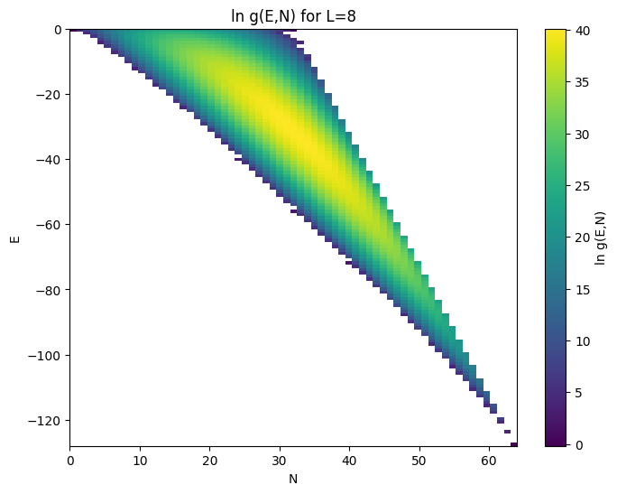
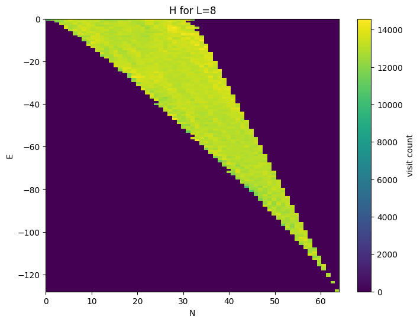
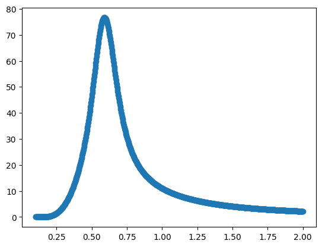
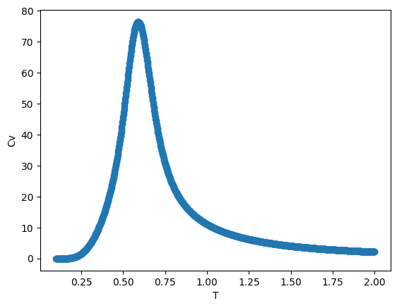
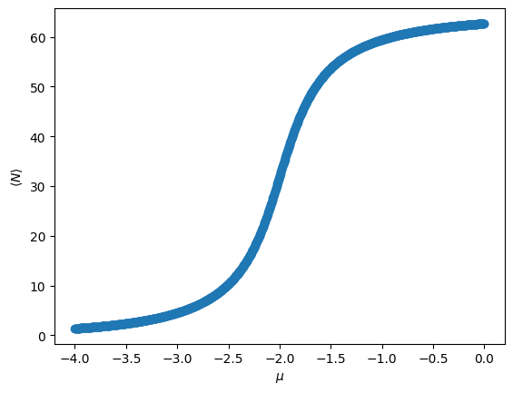
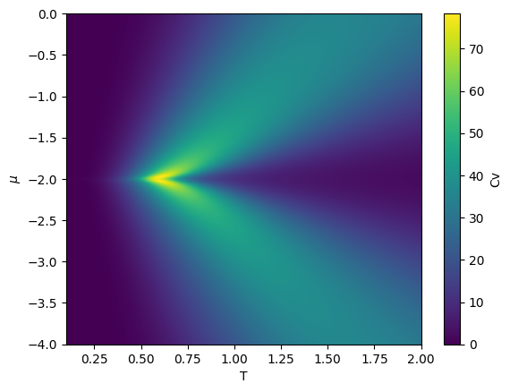
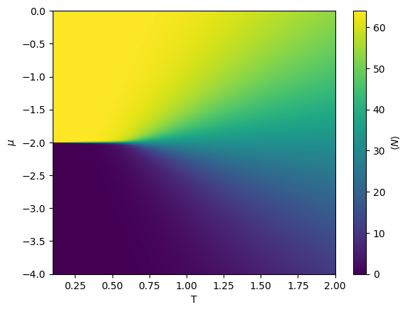

# 2D Lattice Gas — Wang-Landau Monte Carlo

Monte Carlo study of a 2D lattice gas model, mapped exactly from the 2D
Ising model, using the **Wang-Landau algorithm** to compute the joint
density of states $g(E, N)$ and, from it, the full grand-canonical
thermodynamics of the system — including its first-order phase transition
and phase diagram — from a single simulation.

## 1. Physical background

### The lattice gas / Ising mapping

Each site of an $L \times L$ square lattice (periodic boundary conditions)
carries an occupation number $n_i \in \{0, 1\}$. Occupied nearest-neighbor
pairs lower the energy, and a chemical potential $\mu$ controls the
average density:

$$H(n) = -\epsilon \sum_{\langle ij \rangle} n_i n_j - \mu \sum_i n_i$$

This is exactly the 2D Ising model in disguise, via $n_i = (1 + s_i)/2$,
with $\epsilon = 4J$ and $\mu = 2h - 8J$ ($J$ = spin coupling, $h$ =
external field).

### The particle-hole symmetric point

Applying $n_i \to 1 - n_i$ (swapping occupied and empty sites) maps the
system onto itself, energy for energy, only at one special value of the
chemical potential:

$$\mu = -2\epsilon$$

At that point the model is exactly symmetric between the dilute (empty)
and dense (full) phases — the direct analogue of zero external field in
the Ising model. It can be shown (see the derivation this project is based
on) that at $\mu = -2\epsilon$:

* $\langle N \rangle(T) = L^2/2$ for **every** temperature, exactly.
* The grand-canonical specific heat $C_v(T,\mu) = d\langle H\rangle/dT$
  (with $H = E - \mu N$, not $E$ alone — see §3) is exactly
  mirror-symmetric about $\mu = -2\epsilon$.

This symmetric point is where the model's genuine (first-order, becoming
critical at $T_c$) phase transition lives, and it is the $\mu = -2\epsilon$
value used as the anchor throughout this project.

### Onsager's exact result

For the 2D square lattice, Onsager's exact solution gives:

$$\frac{k_B T_c}{J} = \frac{2}{\ln(1+\sqrt{2})} \approx 2.269$$

With $\epsilon = 4J$ and $k_B = 1$, this is $T_c/\epsilon \approx 0.567$.
Every $T_c$ estimate in this project is compared against that exact value;
the small residual deviation is the finite-size effect expected for a
finite $L$.

## 2. Method: why Wang-Landau instead of plain Metropolis

Plain (grand-canonical) Metropolis samples configurations proportionally
to their Boltzmann weight, at one fixed $(T, \mu)$. Two things make it a
poor fit for mapping out this system's full phase diagram:

1. **Cost.** A conventional Metropolis run only gives good statistics at
   the single $(T, \mu)$ point it was run at. Exploring a grid of, say,
   $1000 \times 1000$ $(T, \mu)$ points — as this project does — would
   require a million independent simulations.
2. **Trapping near the first-order transition.** Close to coexistence
   ($\mu \approx -2\epsilon$, $T < T_c$), the dilute and dense phases are
   separated by a free-energy barrier of rare intermediate configurations.
   Because Metropolis avoids low-probability states by design, it gets
   trapped in one phase for a time that grows exponentially with system
   size, instead of sampling both phases.

Wang-Landau sidesteps both problems. It builds a **flat histogram in
$(E, N)$ space** rather than sampling by Boltzmann weight, using an
acceptance rule based on the (still unconverged) density of states itself:

$$P_{\text{accept}} = \min\left(1, \frac{g(E_{\text{old}}, N_{\text{old}})}{g(E_{\text{new}}, N_{\text{new}})}\right)$$

This actively pushes the random walk toward under-visited states,
including the rare configurations that bridge the two phases — which is
exactly what defeats Metropolis. The one simulation produces $g(E, N)$,
independent of $T$ and $\mu$, from which **any** thermodynamic quantity at
**any** $(T, \mu)$ — or an entire grid of both — is a cheap post-processing
sum, with no further simulation required.

## 3. A subtlety: $C_v$ means $d\langle H\rangle/dT$, not $d\langle E\rangle/dT$

Away from the symmetric point, $d\langle E\rangle/dT$ at fixed $\mu$ ($E$ =
bond energy alone) is *not* guaranteed non-negative — and in this
project's grand canonical map it visibly goes negative near the
coexistence line. This is not a bug: the thermodynamic guarantee of a
non-negative specific heat applies to $\mathrm{Var}(H)/T^2$, where
$H = E - \mu N$ is the *full* grand Hamiltonian (a genuine variance, hence
non-negative by construction), not to a variance of $E$ alone. The two
only coincide when $\langle N\rangle$ does not depend on $T$, which is
exactly the situation at the symmetric point $\mu = -2\epsilon$ (see §1).
Every $C_v$ reported here is computed from $H = E - \mu N$.

## 4. Repository structure

```
.
├── README.md
├── requirements.txt
├── figures/                       # standalone copies of the key result plots
└── notebooks/
    ├── 1D_wang_landau.ipynb       # warm-up: 1D walk, mu fixed at -2*eps
    └── 2D_wang_landau.ipynb       # main result: joint (E,N) walk, mu free
```

`1D_wang_landau.ipynb` is the first, simpler version of the project: a
single-variable Wang-Landau walk over the total grand energy
$H = -\epsilon \cdot \text{bonds} - \mu N$, with $\mu$ fixed from the
start. It was used to validate the method (correct $T_c$, correct
$C_v(T)$ peak) before extending it to the full 2D version.

`2D_wang_landau.ipynb` is the main result: a joint random walk over
$(E, N)$, with $E$ the bond energy alone. $\mu$ is not fixed during the
simulation — it is a free parameter introduced only when building the
grand-canonical partition function $\Xi(T, \mu)$ afterwards, which is
what makes it possible to explore the full $(T, \mu)$ phase diagram from
one run.

## 5. Requirements

```
pip install -r requirements.txt
```

## 6. Results

All results below are for an $8\times8$ lattice ($\epsilon = 1$,
$k_B = 1$).

### Density of states and visit histogram

The joint density of states $g(E, N)$ and the Wang-Landau visit
histogram, both restricted to the $(E, N)$ region the random walk
actually reached — a diagonal band, since the bond energy at fixed $N$
is bounded by how densely those $N$ particles can be packed:

<p align="center">
  
  
</p>

### Specific heat $C_v(T)$ at $\mu = -2\epsilon$

Computed two independent ways — the 1D walk ($\mu$ fixed in the
simulation itself) and the 2D walk ($\mu$ introduced in post-processing)
— and they agree:

<p align="center">
  
  
</p>

Both give **$T_c \approx 0.589$**, versus the exact Onsager value of
0.567 (~4% finite-size deviation for $L=8$, in the expected direction).

### The first-order transition: $\langle N\rangle(\mu)$

At $T = 1.0$ (above $T_c \approx 0.589$), the crossover from the dilute
to the dense phase is smooth, with no discontinuity — as expected, since
there is no phase transition above $T_c$:

<p align="center">
  
</p>

The inflection point still sits almost exactly on the symmetric value,
$\mu_c \approx -1.998$ (theory: $-2.000$) — a third, independent
confirmation of the same critical point, this time located via the
$\mu$-axis rather than the $T$-axis.

### The full $(T, \mu)$ phase diagram

Repeating the $C_v$ and $\langle N\rangle$ calculations over a full grid
of $(T, \mu)$ — a cheap post-processing sweep over the single
precomputed $g(E, N)$ table — reconstructs the complete phase diagram:

<p align="center">
  
  
</p>

The $C_v$ map shows the classic shape of a first-order line terminating
at a critical point: a narrow, tall ridge of large fluctuations running
along $\mu = -2\epsilon$ for $T < T_c$, closing to a single point exactly
at $(T_c, -2\epsilon)$, and no structure at all for $T > T_c$. The
companion $\langle N\rangle(T, \mu)$ map shows the same story directly in
the order parameter: a sharp jump between the dilute and dense phases
below $T_c$, smoothing into a continuous crossover above it.

## 7. Physical interpretation

The lattice gas language maps directly onto a real, measurable system:
adsorption of a gas onto a crystal surface. $\mu$ is the chemical
potential of the surrounding gas reservoir (set experimentally by its
pressure at fixed $T$), and $\langle N\rangle(\mu)$ is the surface's
adsorption isotherm. The sharp jump found here is a first-order
**condensation** of the adsorbed layer — an abrupt jump in surface
coverage at a critical pressure — and the same model, in its original
spin language, describes the discontinuous jump in magnetization of a
ferromagnet as an external field crosses zero below its Curie
temperature.
